# Gaijin-Store-Bot 
This repository contains a Telegram bot that scraps gaijin's premium store and sends an alert if a new pack is added or if prices change

Using the bot's commands your are able to filter by selecting:
- The countries
- The tiers
- The vehicle types (air, groud, sea)

## How it works

There are 4 commands:

- `/tiers`: Allows you to select the tiers you are interested in
- `/vehicles`: Allows you to select the type of vehicles you want
- `/nations`: Allows you to select the nations you want
- `/packs`: Retrieves the list of premium packs according to the selected tiers, vehicles types and nations.

### Example


## Diagram

```mermaid
sequenceDiagram
    participant U as User
    participant B as Telegram Bot
    participant G as Gaijin Store (War Thunder)
    participant D as Cache

    Note over U, B: Configuration Phase
    U->>B: /nations, /ranks, or /vehicles
    B-->>U: Sends selection keyboard
    U->>B: Selects option
    B->>D: Store user preferences

    Note over U, G: On-Demand Request
    U->>B: /packs
    B->>D: Fetch user preferences
    B->>B: Build URL from user preferences
    B->>G: Scrap page
    G-->>B: Return HTML/Data
    B->>D: Store latest scrap result
    B-->>U: Send formatted packs & prices

    Note over B, G: Automated Polling (Every 300s)
    loop For each user
        B->>B: Build dynamic URL from stored prefs
        B->>G: Scrap page
        G-->>B: Return current HTML/Data
        B->>D: Compare with last stored scrap
        
        alt New Element Found
            B->>U: 🔔 Notification: New items available!
            B->>D: Update cache
        else Price Changed
            B->>U: 📉 Notification: Prices have been updated!
            B->>D: Update cache
        end
    end
```



## Installation
To install and run the Gaijin-Store-Bot, follow these steps:

1. Clone the repository to your local machine:
    ```
    git clone https://github.com/Slyvred/Gaijin-Store-Bot.git
    ```

2. Navigate to the project directory:
    ```
    cd Gaijin-Store-Bot
    ```

3. Install the required dependencies:
    ```
    pip install -r requirements.txt
    ```

4. Create a Telegram bot and obtain the API token. You can follow the official Telegram documentation for instructions on how to create a bot.

5. Create a `.env` file in the project directory and add the following content:
    ```
    API_TOKEN=<your_telegram_api_token>
    ```

6. Run the bot:
    ```
    python main.py
    ```

That's it! The Gaijin-Store-Bot should now be up and running. You will receive alerts whenever a new plane is added or if prices change in the Gaijin premium store.

## Usage
Alternatively, if you don't want to go through the hassle of setting up the bot yourself, you can simply use the already hosted version. Just head over to [t.me/gaijinstorecheckerbot](https://t.me/gaijinstorecheckerbot) and start using it right away!
